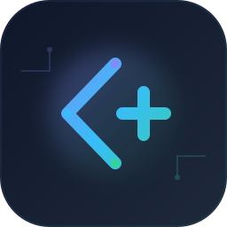

<div align="center">



# API Plus

**Claude / GPT / Gemini 统一 API 入口**

低倍率、可订阅、稳定可用。适合个人高频使用，也适合 Claude Code、常用 AI 客户端、脚本和工作流。

**官网直达：<https://api.apiplus.cloud/>**

[立即使用](https://api.apiplus.cloud/) · QQ 交流群：`1013703708` · [TG 群](https://t.me/+VNpUktMGfmRlYzk1)

</div>

---

## 首屏重点

- Claude 目前提供 `4` 个渠道可选
- Claude 最低可用到 `0.15` 倍率
- Claude 稳定档 `0.5` 倍率，效率接近 `Max` 号体验
- GPT 当前公开倍率可到 `0.15`
- 价格、活动、渠道状态以官网实时页面和公告为准

## 当前热门套餐

| 套餐 | 当前价格 | 当前亮点 |
| --- | --- | --- |
| Claude 月卡 | `¥199 / 月` | `600` 刀额度，适合长期高频使用 |
| GPT 月卡 | `¥179 / 月` | `1200` 刀额度，适合日常持续调用 |

> 以上价格信息按 `2026-04-17` 当前公开套餐整理，实际以官网实时页面为准：<https://api.apiplus.cloud/>

## 为什么很多人选择 API Plus

### 价格更友好

如果你最关心的是长期使用成本，API Plus 的核心优势就是把常用模型做成更适合持续使用的价格体系。

- Claude 提供低价档与稳定档
- Claude 低价档最低 `0.15` 倍率
- GPT 当前 `0.15` 倍率
- 提供月卡方案，适合高频稳定使用
- 官网也会不定期开放福利渠道

### 稳定性更适合日用

API Plus 不只是追求便宜，也在持续做多渠道和备用通道，尽量降低单一上游波动对体验的影响。

- Claude 提供多渠道可选，不同需求可以选不同档位
- 稳定档 `0.5` 倍率，适合更看重可用性和效率的使用者
- 上游异常时可以切换备用渠道，减少长时间不可用的概率
- 官网公告会同步渠道变动、倍率调整和异常处理说明

### 更适合长期使用

除了网页直接使用，API Plus 也更适合接入你自己的常用客户端和工作流。

- 统一 API 入口，接入成本低
- 适合个人日常高频使用
- 适合长期接入自己的脚本、工具链和 AI 客户端
- 官网持续同步活动、福利和渠道状态

## 适合哪些使用者

| 适合场景 | API Plus 提供的价值 |
| --- | --- |
| Claude Code 场景 | 多渠道可选，便于在成本和稳定性之间取平衡 |
| Claude 重度用户 | 多渠道可选，低价档和稳定档都能覆盖 |
| GPT 高频用户 | 当前公开倍率低，适合长期日用 |
| AI 客户端用户 | 统一 API 接入，方便接到常用桌面和网页客户端 |
| 自己写脚本/工作流的人 | 保持统一接口，减少来回切换供应商的成本 |
| 想先低成本试用的人 | 官网会不定期开放福利渠道和活动 |

## 常见接入方式

根据官网公开状态，API Plus 适合接入这些常见客户端和工作流：

- Claude Code
- Cherry Studio
- Lobe Chat
- OpenCat
- AionUI
- AI as Workspace
- AMA 问天
- 自己的 OpenAI 兼容脚本和工具链

如果你已经有现成客户端或工作流，通常只需要把接口地址切到：

```text
https://api.apiplus.cloud/v1
```

## 公告与渠道信息

官网公开信息里可以直接看到近期渠道维护和价格调整，这一点比单纯写“稳定”更有说服力。

- `2026-04-15` 公开公告提到 GPT 渠道已调整到 `0.15` 倍率
- `2026-04-14` 公开公告提到上游异常后进行了备用渠道切换，并对受影响额度做返还处理
- 官网 FAQ 公开提到福利渠道会不定期开放，低至 `0.01` 折

如果你更关心实时变化，建议直接看官网和群公告：

- 官网：<https://api.apiplus.cloud/>
- QQ 群：`1013703708`
- TG 群：<https://t.me/+VNpUktMGfmRlYzk1>

## 现在就去用

如果你主要关注的是：

- Claude 是否有更便宜又能用的渠道
- GPT 是否有更适合长期日用的倍率
- 是否能接到自己的客户端和脚本里
- 遇到上游波动时有没有备用方案和公告同步

那直接从官网开始最省时间：

**<https://api.apiplus.cloud/>**

## 关于这个仓库

这个仓库主要用于公开介绍 API Plus 的产品信息、价格亮点和接入方向，不提供完整业务源码、私有配置或生产部署资产。

如果你想直接体验产品、查看最新价格、关注公告或加入社群，请以官网为准：

- 官网：<https://api.apiplus.cloud/>
- QQ 群：`1013703708`
- TG 群：<https://t.me/+VNpUktMGfmRlYzk1>

## 上游说明

API Plus 基于 `new-api` / `One API` 生态继续扩展，并围绕价格、渠道、稳定性和长期使用体验做了进一步产品化。

相关上游项目：

- [new-api](https://github.com/QuantumNous/new-api)
- [One API](https://github.com/songquanpeng/one-api)
